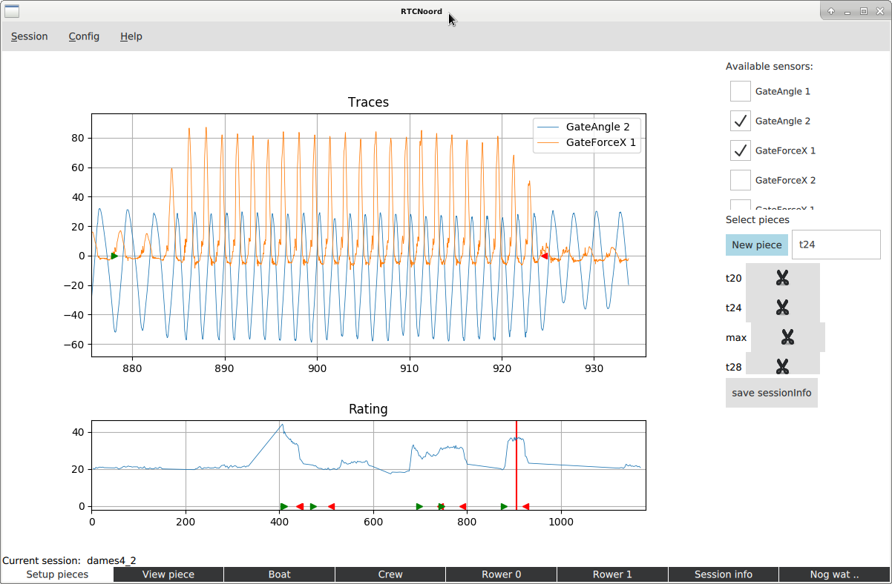
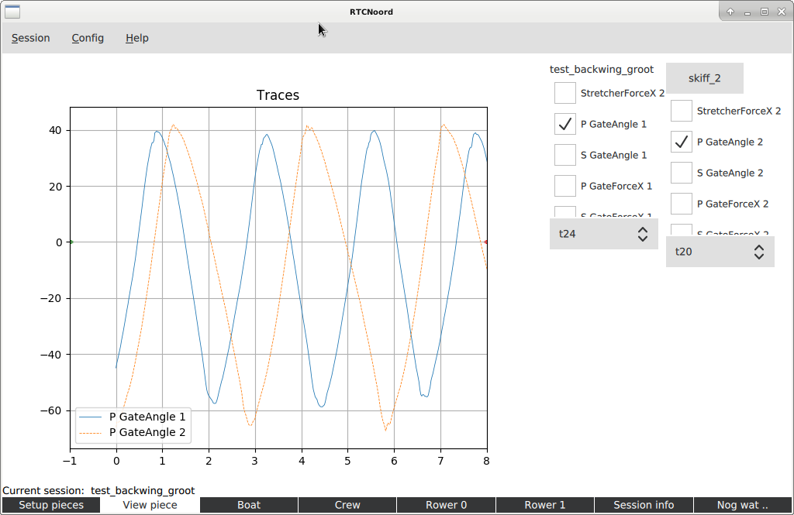
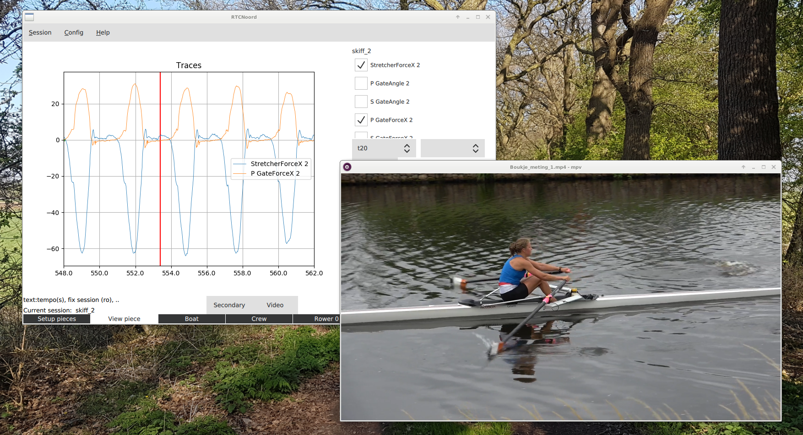
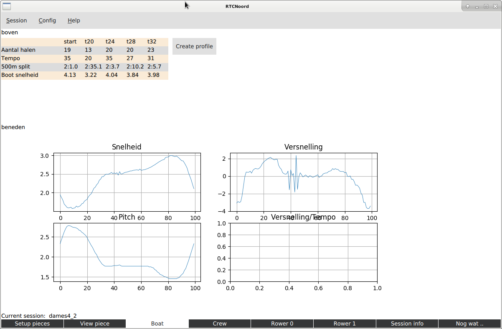

# RtcNoordApp

Process data from the Powerline system from Peach Innovations.
This system collects data from a rowing boat using various sensors.

## Usage

  - Currently, start the program from the App directory with: "python main.py"
  - Create a csv-file from the interesting part of a session using the Powerline software and put it in the csv-data directory.
  - Start the app and select the csv-file from the menu.
    Now data is preprocessed and saved in a sessionInfo-file and a dataObject-file.
  - The program consists of several tabs.
      - Setup pieces: the interesting parts can be selected for further study.
      - View pieces: study the sensordata in detail, comparing with other session, ...
      - Profile: if the proper pieces are selected a profile of the crew and individual rowers can be created.

## Status

   - This is a very basic version, only a few screens are setup.

## Screenshots

Here a few screenshots to give an idea.
Sessions can be created or selected from the menu at the top.
Below there are the tab-buttons to select the part of the program we wish to use.

### Setup Pieces

The first picture show the initial screen, used to select the interesting pieces from the session.
This is a requirement if a profile is to be made.

We can select the different sensors by checking the sensors, here two sensors are selected.
The currently selected pieces are shown in the right part of the screen.

### View Piece

In the View Piece tab we can study the traces in more detail.
In this example two different sessions are selected to compare traces from these sessions.
Here the gate-angle and -force are shows from two different scullers.
Note that the traces are not yet "normalised" to make a better comparision possible.

### Using video

Although not working completely, we already can put a video next to a view piece, where the red line is to be the point the still is showing.

### Boat Profile

When the correct pieces are selected a profile is created to aid in the interpretation of the data.
The image shows a very basic first version of this tab.
There eventually also will be tabs for the Crew and the individual rowers.

   